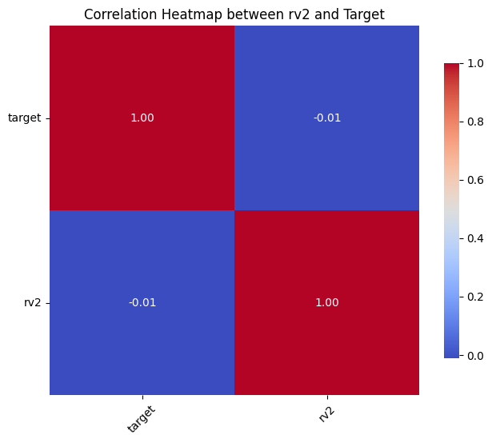
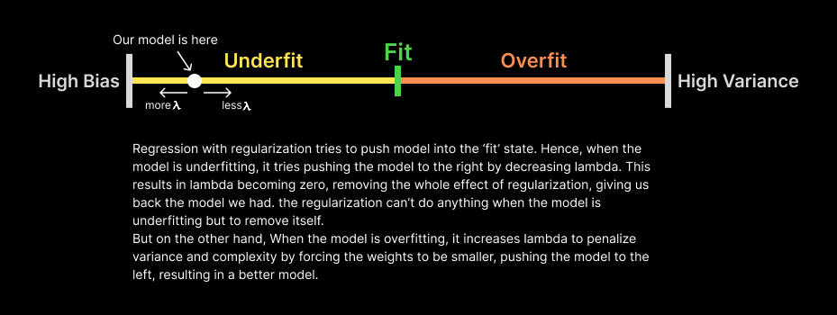

# Appliances Energy Prediction

Quick access:
- [Objective](#objective)
- [How to run](#how-to-run)
- [Quick Look on The Dataset](#quick-look-on-the-dataset)
- [Comparing Models Performance](#model-performance-comparison)
  - [Models Performance Table](#models-performance-table)

## Objective

Given a dataset, we're asked to predict appliances energy consumption by a house in a ten minute priod while we're given weather details, by using a proper regression model.

This ReadMe.md file explains the theory behind every step I make, while you can find more information on how I implement the ideas by reading the notes in the notebooks.

- Dataset: [Appliances Energy Prediction Dataset from Kaggle](https://www.kaggle.com/datasets/loveall/appliances-energy-prediction)
- Libraries Used: Numpy, Matplotlib, Pandas, Scikit-learn, Seaborn

## How to Run

## Dataset Overview
Dataset includes information in 10 minute periods. In each row, humidty, temperature, and other quantities of the house are given for that ten minute period, plus information from a nearby weather station. Tempreture, humidity and other details of the outside evnironment is measured twice, one by the house sensors and one by the weather station.

To see detailed information about the dataset, [visit here](https://www.kaggle.com/datasets/loveall/appliances-energy-prediction).

We're also provided with two random variables, and the mean of the target variable is 97.69 Wh, calculated in `data_inspect.ipynb`

## First Approach

Because all values are continuous, a regression model could be used. We will have a lot of weights, which reduces model interpretability and can lead to overfitting. Hence, we use L1 or L2 regularization, to prevent overfitting and keep the model explainable while making accurate predictions. This will be our cost function:

$J_{λ}(w) = J(w) + λR(w)$

Higher λ results in less variance(More explainable model) but higher J(w) therefore higher bias. Lower λ results in higher variance(More complex model) but lower J(w) therefore lower bias. By optimizing the hyperparameter λ, we can find the sweetspot in bias-variance tradeoff for our model.

Exact value for λ and preferred norm(L1 or L2) will be determined in cross-validation phase. First we train two models, one with L1 and one with L2.

Here's the training timeline:
1. Split the data into training and test
2. Train two models on the same training set, ridge regularization and lasso regularization.
3. Find the best λ for each model.
4. Compare the models to choose the better one.
5. Repeat the process above for polynomial regression and compare it to the current linear regression model

A proper regularization must determine which weights are more important and which are less important(features irrelevant to our target) so they end up with zero or close to zero value. Hence, rv1 and rv2 (random variables in the data set) should be nearly zero or excatly zero, in a good regularization, otherwise the model is hallucinating, seeing patterns and relations that doesn't exist.

Our data is noisy, it seems to have a lot of irrelevant features, however with a good regularization, we can reduce the effect of the noise on the model, and force the model to pay attention to the features that actually matter.

## Random Variables

As I mentioned, there are two columns of random variables that are irrelevant to our target variable(I'll use them later for model validation). Before training the model, Let's make sure they really have no relation with the target variable:

| Correlation: rv1 vs Target | Correlation: rv2 vs Target |
| :---: | :---: |
|  |  |

As we can see in the correlation matrices, magnitudes of numbers assigned to correlation between target and v1, or target and v2, are very low ~0.01. We can conclude that there is no relation between random variables and the target, they're totally irrelavent to the target.

## Data Preprocessing

### Date column

The first column includes time in date format and is not clean continuous number, therefore its format needs to be changed.

Because times are ten minute values for 4-5 months, the absolute value of time doesn't matter here, There are periodic states like weekday or hour of the day, month, these are the metrics that actually have impact on the target variable. Hence, we replace this column with columns representing weekday and hour of the day.

If we extract one column for "hour", which contains numbers from 0 to 23, it will cause problems. Hour is a cyclic variable, the distance between every two consecutive hours is the same. But in our model, the number 23(11PM) is very far from the number 0(12AM), while in reality they're only one hour apart, just like other consecutive hours. If we use this (0, 23) numerical scale to represent hours, our model fails understanding that 11PM and 12AM are almost identical, it assumes they're very far, failing to understand the "Cyclical Continuity" that exists in our data.

To fix this, we have three good options:

- Using Sin/Cos to put hours on a circle (adds 2 columns)
- One-Hot encoding (adds 24 columns)
- Binned One-Hot encoding (adds 4 columns)

#### Using Sin/Cos

The first option adds two columns to represent hour:

1. `hour_sin`: $Sin(2\pi \cdot \text{hour} / 24)$
2. `hour_cos`: $Cos(2\pi \cdot \text{hour} / 24)$

To see what it does, imagine the unit circle $x^2 + y^2 = 1$ where for every dot on the circle $x=Cos(\alpha)$ and $y = Sin(\alpha)$. For every hour $\alpha = 2\pi \cdot \text{hour} / 24$ is an angle from $0$ to $2\pi$. Hence, these formulas put all our 24 hours on a unit circle(They assign a dot on the circle for each hour), in a way that all the dots are evenly spaced, creating the "Cyclical Continuity" we were looking for.

This way, the model thinks of every hour as a dot on the unit circle, where `hour_sin` and `hour_cos` show its exact coordinates. It tries to combine these triangular functions to create a wave-like function that shows the relation between 'hour of day' and 'energy consumed'.

This method doesn't add many columns hence it's efficient, but it only creates wave patterns, which wouldn't be able to catch some of the ups and downs and sudden jumps that could happen in a daily timeline. For instance, energy consumption might be constant from 3PM to 7PM but it may suddenly jump for thirty minutes, because someone has started using the oven for cooking, then the consumption would decrease to where it was. It's hard for a wave-like function constructed with Sin and Cos to catch such a jump, though not impossible.

#### One-Hot Encoding & Binned One-Hot Encoding

In One-Hot Encoding, we add 24 columns, each one for one hour of the day, if we're in that hour, its value will be one and other columns will be zero. The model learns to assign a weight for each hour seperately, showing the impact that single hour has on our target. This method is very effective in regression. Because it looks at each hour seperately, it can easily adupt to sudden jumps, and if given enough data, it's so flexible and can easily determine the impact of each hour on our target variable percisely. It's also so interpertable, after the model is learned we can see how energy consumption changes for every hour and find the peak hours.

However, it has a downside, it adds a lot of columns to our data, this is why sometimes people use Binned One-Hot Encoding(they add four columns for morning, afternoon, evening and night instead, this method is much less flexible in catching sudden jumps or understanding the difference between consecutive hours, because it assumes 2PM & 3PM have the same impact on the target while this can be very wrong in special cases. it sacrifises percision for simplicity and lower dimensionality) or continue with Sin/Cos. However, because we have more than 20000 rows, even by adding 24 more columns we're in a safe zone for linear regression, what causes problem is polynomial regression.

| Method | One-Hot Encoding | Binned One-Hot | Sin/Cos (Cyclical) |
| :--- | :--- | :--- | :--- |
| **Dimensionality ($P$)** | High | Low | Very Low |
| **Interpretability** | High (Clear weight per hour) | Intermediate | Intermediate |
| **Convergence Speed** | Slow(due to high $P$) | Fast | Fast |

For every $x$ polynomial regression adds $x^2$, $x^3$, . . . depending on the degree and also the combination of terms such as $x \times y$ etc. (sckit-learn PolynomialFeatures) by adding columns for hours we have around 50 columns, in polynomial with degree two, we have 1,500 features and for degree three we have +25,000 features which is higher than the number of rows and leads us to overfitting.

But there's a solution to that. The 24 columns added from One-Hot encoding don't need to be powered, because $x^n = x$ for these columns. And because two hours never happen at the same time, $x \times y$ is always zero when both terms are from these columns. Hence they don't need to be multiplied by themselves. These reduce a lot of new features. We can be selective when creating new polynomial terms, any term in which sum of powers of OHE columns(that come from the same encoding) is larger than one is always zero, representing no information, hence it will be removed to keep the feature space small.

We train different models using different encoding options explained above and compare their performance to find the best model. Weekdays will also be encoded using the options above.

### Train, Test, Validation

We split the dataset into Train 80% and Test 20%. When training the model with Lasso regularization, K-Fold cross-validation is used to compare different values for $\lambda$, which splits training subset into K subsets, each one used once as the validation set. After the best $\lambda$ is found, we retrain the model on the whole training set to get the final weights. For Ridge regularization on the other hand, LOOCV(Leave-One-Out Cross Validation) is utilized using scikit-learn's RidgeCV to find the best $\lambda$. It's significantly faster and very accurate when the data doesn't have a lot of outliers. Again, the model is retrained on the whole data after the best $\lambda\$ is found.

Feature scaling is done using scikit-learn pipeline, this ensures scaling happens after each K-Fold subset creation, preventing data leakage. Each time the pipeline divides our training into a validation set and a new training subset, the mean and std is calculated using the new training subset, preventing data leakage.

## Training, Comparing, Analyzing & Explaining Models

### Attention!

What you see here is condensed summary. of what I did in `experiment.ipynb` file. For every passage I write below, I leave a reference to this file(e.g. section 3.3, etc.), By going to that reference you can find strong brief explanations, evidences, proofs and more details for that claim.

A lot of details that were discussed in `experiment.ipynb` aren't talked here, to keep the ReadMe.md small. Hence to learn more, you can go to the experiment notebook file `experiment.ipynb`. In fact you can abandon the ReadMe.md from here and read `experiment.ipynb` instead if you want to see all the topics and details. Otherwise for a very summarized version, continue reading this ReadMe.md

### Degree One Models

#### Choosing encoding

Four models were trained, same regularization but different encoding(table.1). All the models were underfitting(High MAE compared to average value for target). Ratios were almost the same, hence the model with one-hot encoding for both hour & week was chosen due to better RMSE & $R^2$ ratio(section 3.2.1).

| Deg | Hour | Week | Reg | Train R² | Test R² | Train RMSE | Test RMSE | Ratio (Test/Train RMSE) | Test MAE | rv1 | rv2 |
|:---:|:---:|:---:|:---:|:---:|:---:|:---:|:---:|:---:|:---:|:---:|:---:|
| 1 | ohe | ohe | lasso | 0.235 | 0.232 | 90.19 | 87.68 | 0.972 | 50.88 | 0.258 | 0.000 |
| 1 | ohe | trig | lasso | 0.232 | 0.228 | 90.37 | 87.92 | 0.973 | 50.85 | 0.271 | 0.000 |
| 1 | trig | ohe | lasso | 0.203 | 0.205 | 92.08 | 89.19 | 0.969 | 51.68 | -0.013 | -0.000 |
| 1 | trig | trig | lasso | 0.200 | 0.201 | 92.26 | 89.40 | 0.969 | 51.62 | -0.001 | -0.000 |

*Table-1: rv1 is the weight assigned to rv1 by the model, also rv2. Reg is short for regularization method, deg stands for model's degree. Hour represents encoding method used for hour column, ohe is one-hot, trig is cyclical/trigonometric, same goes for Week.

#### Choosing Regularization

Because the models were underfitting, regularization had no serious effect(table.2), this is because of Regularization Paradox which I explained briefly in section 3.3.1. This paradox says that in underfitting models, the best value for $\lambda$ is zero(see the diagram image below - image.1). Hence we expect ridge $\lambda$ to be close to zero but it isn't, this is not because our claim is false; the real reason is that the sensivity of ridge to change of $\lambda" is much less than lasso, hence 11.4976 and 0.0197 have very little difference in affecting the model(table3.), and due to noise and uncontrolable bias that might happen in different parts of our process such as K-Fold validation, the model might not be able to see the difference between these two values in performance, and will think that 11.4976 is a better value than a number very close to zero such as 0.0197(If obscure, go to section 3.3.2 for a detailed explanation defending this claim).

Because regularization didn't bring any value, we chose to continue with a normal regression without regulariztion, but with one-hot encoding for both hour and week.

Also, one more simple supporting experiment were done in section 3.3.4 to validate the claims.

| Deg | Hour | Week | Reg | Train R² | Test R² | Train RMSE | Test RMSE | Ratio (Test/Train RMSE) | Best $\lambda$ | rv1 | rv2 | CrossVal |
|:---:|:---:|:---:|:---:|:---:|:---:|:---:|:---:|:---:|:---:|:---:|:---:|:---:|
| 1 | ohe | ohe | lasso | 0.235 | 0.232 | 90.19 | 87.68 | 0.972 | 0.0197 | 0.258 | 0.000 | 5 Folds |
| 1 | ohe | ohe | ridge | 0.235 | 0.232 | 90.19 | 87.68 | 0.972 | 11.4976 | 0.139 | 0.139 | LOOCV |
| 1 | ohe | ohe | ridge | 0.235 | 0.232 | 90.19 | 87.68 | 0.972 | 11.4976 | 0.139 | 0.139 | 5 Folds |
| 1 | ohe | ohe | regressor | 0.235 | 0.232 | 90.19 | 87.69 | 0.972 | - | 0.142 | 0.142 | - |

*Table-2 CrossVal stands for Cross-Validation method. By 'regressor' in Reg column we mean regression without any regularization.

| Deg | Hour | Week | Reg | Train R² | Test R² | Train RMSE | Test RMSE | Ratio (Test/Train RMSE) | Fixed $\lambda$ | rv1 | rv2 | CrossVal |
|:---:|:---:|:---:|:---:|:---:|:---:|:---:|:---:|:---:|:---:|:---:|:---:|:---:|
| 1 | ohe | ohe | ridge | 0.235 | 0.232 | 90.19 | 87.69 | 0.972 | 0.0197 | 0.142 | 0.142 | 5 Folds |
| 1 | ohe | ohe | ridge | 0.235 | 0.232 | 90.19 | 87.68 | 0.972 | 11.4976 | 0.139 | 0.139 | 5 Folds |
| 1 | ohe | ohe | lasso | 0.235 | 0.232 | 90.19 | 87.68 | 0.972 | 0.0197 | 0.258 | 0.000 | 5 Folds |
| 1 | ohe | ohe | lasso | 0.056 | 0.060 | 100.22 | 97.01 | 0.968 | 11.4976 | -0.000 | -0.000 | 5 Folds |

*Table-3

An image summary on why $\lambda$ became zero, explaining bias-variance tradeoff and regularization together.

### Degree Two Models

Because the previous models could not explain our data properly due to low variance, we increase the complexity by implementing degree two polynomial features, also utilizing the OHE filtering we discussed earlier in this ReadMe.md

**When training lasso models with 5-Fold cross-validation using scikit-learn's LassoCV, I got a convergence-warning, hence I tuned LassoCV to ensure convergence happens, how I tuned lasso is briefly explained in section 3.4.2 with mathematical details.**

#### Lasso Models

RMSE Ratios are almost identical, but $R^2$ ratios differ remarkably. Due to better Ratio models with trig encoding are more stable, but less accurate due to higher RMSE and lower $R^2$. While the ohe+ohe model has less stability, it still stable enough $R^2_{test}/R^2_{train} = 0.85$. **Therefore we choose the ohe+ohe model for its better performance(RMSE & $R^2$) over the test set.**

By looking at the training time, we can see the theory we discussed earlier in the ReadMe; OHE models converge slower due to higher number of columns they create.

All models are underfitting, Train RMSE & Test RMSE are almost indentical(close to one RMSE ratio, very stable) but both are very high compared to the mean of the target. This underfitting is the reason why $\lambda$ is very close to zero(see image.1 or read section 3.3.1). All models have also successfully handled the random noise; again, confirming the model is not overfitting.

| Deg | Hour | Week | Reg | Train R² | Test R² | Train RMSE | Test RMSE | Ratio (Test/Train RMSE) | Ratio($R^2$) | best $\lambda$ | rv1 | rv2 | CrossVal | Training Time |
|:---:|:---:|:---:|:---:|:---:|:---:|:---:|:---:|:---:|:---:|:---:|:---:|:---:|:---:|:---:|
| 2 | ohe | ohe | lasso | 0.392 | 0.333 | 80.45 | 81.70 | 1.016 | 0.850 | 0.0201 | -0.0 | -0.0 | 5-Folds | 295.5(s) |
| 2 | ohe | trig | lasso | 0.368 | 0.322 | 82.02 | 82.39 | 1.005 | 0.875 | 0.0201 | -0.0 | -0.0 | 5-Folds | 260.8(s) |
| 2 | trig | ohe | lasso | 0.324 | 0.296 | 84.78 | 83.91 | 0.990 | 0.914 | 0.0251 | -0.0 | -0.0 | 5-Folds | 161.4(s) |
| 2 | trig | trig | lasso | 0.302 | 0.284 | 86.17 | 84.63 | 0.982 | 0.941 | 0.0251 | -7.92e-16 | -7.92e-16 | 5-Folds | 153.6(s) |

*Table-4

#### Ridge Models

By replacing trigonometric encoding with one-hot encoding, Test $R^2$ stays the same hence model's ability to explain the test set does not change, but the Train $R^2$ increases. This increase means the model is learning more, because it can explain more of the training set, but what it is learning is noise, not pattern, therefore the model can explain the training data better but its ability to explain unseen data remains the same. we can see the same pattern for RMSE. In another words, replacing trig encoding with one-hot pushes the model towards overfitting(learning noise). The lower $R^2$ ratio in ridge+ohe models confirms this fact.

In short, all models have almost the same performance on the test set but the **fourth model**(trig+trig+ridge) has better generalization and is more stable, due to its better ratios. hence **it's the best ridge model out of this list**. It's also more efficient due to less amount of features it creates.

The weights chosen for random variables also acknowledge the claim. while all models successfully determined these variables are irrelevant to our target hence minimized their weights, the trig+trig model has gave them weights that are four times less than the weights in ohe+ohe. This means that ohe+ohe model is more hallucinating compared to the fourth model, confirming the overfitting claim.

| Deg | Hour | Week | Reg | Train R² | Test R² | Train RMSE | Test RMSE | Ratio (Test/Train RMSE) | Ratio($R^2$) | best $\lambda$ | rv1 | rv2 | CrossVal |
|:---:|:---:|:---:|:---:|:---:|:---:|:---:|:---:|:---:|:---:|:---:|:---:|:---:|:---:|
| 2 | ohe | ohe | ridge | 0.473 | 0.347 | 74.86 | 80.84 | 1.080 | 0.733 | 0.0071 | -0.088 | -0.088 | LOOCV |
| 2 | ohe | trig | ridge | 0.445 | 0.343 | 76.83 | 81.08 | 1.055 | 0.771 | 0.0040 | -0.045 | -0.045 | LOOCV |
| 2 | trig | ohe | ridge | 0.403 | 0.331 | 79.69 | 81.80 | 1.027 | 0.822 | 0.0035 | -0.046 | -0.046 | LOOCV |
| 2 | trig | trig | ridge | 0.374 | 0.324 | 81.60 | 82.24 | 1.008 | 0.867 | 0.0023 | -0.018 | -0.018 | LOOCV |

*Table-5

### Degree Three And Higher

Based on calculations done in section 3.5 with the formula below, higher degrees involve a high number of features, in our 20,000 rows dataset we reach an $N/P$ ratio less than 10 which will probably lead us into overfitting. Hence, we stop increasing the degree of our regression models here at this point.

The number of features after applying a degree $d$ polynomial features on a dataset with $P$ columns is

$$\binom{P + d}{d} = \frac{(P + d)!}{P! d!}$$

| Columns ($n$) | Degree 2 Features | Degree 3 Features | Degree 4 Features |
| :---: | :---: | :---: | :---: |
| **32** | 561 | 6,545 | 52,360 |
| **59** | 1,830 | 37,820 | 595,665 |

*Our dataset has around 20,000 rows

## Choosing The Final Best Model

### The Best Model

Out of 16 models we selected three models we believed are the best among the models with the same regularization type as themselves.

Lasso model is slightly better in $RMSE$ & $R^2$ compared to the ridge model but is almost the same in other metrics and is 30 times slower to converge. This leaves us with ridge and degree one model(regressor) that has no regularization. Both have good ratios while regreesors's ratios are better, signaling more stability. Because we aim for a balance in accuracy and stability and ridge is more accurate due to its better $RMSE$ & $R^2$ and also has identified the noise better and gave the random variables less weights, **the ridge model is the final winner**.

The degree one regression model might be nearly perfect in ratios, but it's remarkably less accurate. Ridge ratios aren't perfect but good enough.

| Deg | Hour | Week | Reg | Train R² | Test R² | Train RMSE | Test RMSE | Ratio (Test/Train RMSE) | Ratio($R^2$) | Best $\lambda$ | rv1 | rv2 | CrossVal | Training Time |
|:---:|:---:|:---:|:---:|:---:|:---:|:---:|:---:|:---:|:---:|:---:|:---:|:---:|:---:|:---:|
| 1 | ohe | ohe | regressor | 0.235 | 0.232 | 90.19 | 87.69 | 0.972 | 0.987 | - | 0.142 | 0.142 | - | Less than 1(s) |
| 2 | ohe | ohe | lasso | 0.392 | 0.333 | 80.45 | 81.70 | 1.016 | 0.850 | 0.0201 | -0.0 | -0.0 | 5-Folds | 295.5(s) |
| 2 | trig | trig | ridge | 0.374 | 0.324 | 81.60 | 82.24 | 1.008 | 0.867 | 0.0023 | -0.018 | -0.018 | LOOCV | Less than 10(s) |

* Currently Selected Models

### Why Are All The Models Innaccurate?

All the models we have trained so far, despite all the improvments, are underfitting. This can be seen by looking at RMSE. All models have a high RMSE on train and test compared to the mean of the target variable. But why? we did regularizations, encodings, why didn't we reach a practical model we can use in real world? The reason to this is **noise**.

The target variable we're predicting depends on many factors that do not exist in the given dataset. This is where we say *our data is noisy*. Energy consumption is effected by a lot of sudden and random spikes called noise. Someone might decide to turn on conditioner for thirty minutes in 3AM 12 July because he woke up due to nightmare, and this incident never happened again. These spikes are very hard to explain by mathematic relations or formulas like regression. These spikes happen in every dataset, that is why we always have errors in regression models, But the amount of these spikes in this dataset is much more compared to others, that is why we say this data is noisy(This claim is supported by the plots and diagrams in the next part of ReadMe.md).

Another way to identify this noise is to look for the different target values we have when the values of our dependent variables are almost the same. This means our target is effected by some other variable that is not listed in our dataset.

We didn't find a unicorn perfect model for sure, but we can analyze, plot and explain the current models to discover new information and prove the claims we made earlier.

## Deeper Dive: Proving The Claims and Explaining The Model Using Graphs

I plotted multiple graphs for the best final model(ridge model with trigonometric/cyclic encoding) in `experiment.ipynb`. These graphs can give us a better understanding of what we talked earlier; besides providing more information.

### Residuals vs. Predicted Values Graph

This graph is plotted and analyzed briefly in `experiment.ipynb` section 4.2.1. It proves the calims about random noise we talked earlier along with information about the model's behavior and learning.

### Prediction vs. Actual Values Graph

This graph is plotted and analyzed briefly in `experiment.ipynb` section 4.2.2. It shows how our polynomial model had better learning compared to the degree one model due to more information it had access to because of combinated terms. It also represents the 'nightmare spikes' & random noise we talked, and how the model learned the general routine instead of random events.

### Feature Importance Graph

This graph is plotted and analyzed briefly in `experiment.ipynb` section 4.2.3. It shows the most important features and shows why the polynomial model performed better than the degree one model.